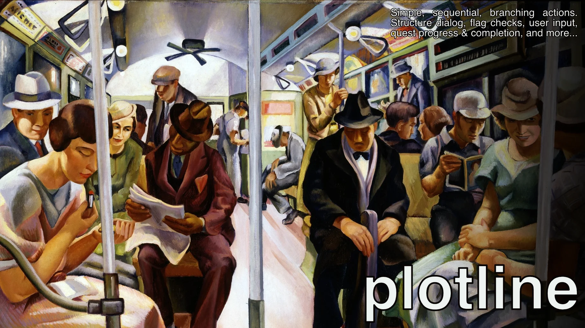

# plotline

[](https://github.com/dp88/plotline/actions/workflows/ci.yml)
[](https://crates.io/crates/plotline)
[](https://docs.rs/plotline)

[](#license)

Branching sequences of events as plain data — dialog, quests, cutscenes,
tutorials — for any engine. The host defines the steps; `plotline` runs
order, branches, subroutines, jumps, and waits.

## Quick start

```toml
[dependencies]
plotline = "0.2"
```

```rust
use core::task::Poll;
use plotline::{Completion, Library, Outcome, Runner, Sequence, TypeMap, steps};

let ready = Completion::new();
let waiting_on = ready.clone();

let mut library = Library::new();
let farewell = library.insert(
    Sequence::new("farewell")
        .with_step(steps::run("Say goodbye", |_ctx| println!("Safe roads."))),
);
let greeting = library.insert(
    Sequence::new("greeting")
        .with_step(steps::run("Say hello", |_ctx| println!("Hello, traveler.")))
        .with_step(steps::run("Wait for the world", move |_ctx| waiting_on.clone()))
        .with_step(steps::Branch {
            condition: None,
            if_true: Some(farewell),
            if_false: None,
        }),
);

let mut runner = Runner::default();
let mut services = TypeMap::new();
runner.start(greeting, None).unwrap();

assert_eq!(runner.advance(&mut library, &mut services), Poll::Pending);

ready.signal();
assert_eq!(
    runner.advance(&mut library, &mut services),
    Poll::Ready(Outcome::Finished),
);
```

## Why

- **Plain data.** A sequence is an ordered list of steps the host defines —
  closures for the simple cases, structs where a step carries state.
- **Subroutines and jumps.** `Call` enters a subroutine and falling off its
  end returns to the caller; `Return` exits early; `Goto` clears the whole
  call chain before starting its target.
- **No clock.** A waiting step returns a `Completion` handle. The host
  signals it and calls `advance()`. The crate does not define timed waits.
- **No engine or runtime dependencies.** `no_std` with `alloc`; the default
  `std` feature adds panic isolation only.
- **Tooling-ready.** Whole-library validation, per-step reference facts, and
  reachability analysis feed editors and linters.

## Requirements and features

- Rust 1.85 or later, edition 2024.
- `no_std` with `alloc`; no required dependencies.
- `std` (default): catches panics in steps. It requires `panic = "unwind"`.
- `--no-default-features` builds without `std` and does not catch panics.

## More examples and documentation

- [API documentation](https://docs.rs/plotline) — rustdoc is the manual:
  steps, built-ins, validation, analysis, and diagnostics.
- [`examples/dialog.rs`](examples/dialog.rs) — run it with
  `cargo run --example dialog`.
- [CHANGELOG](CHANGELOG.md)
- [Issue tracker](https://github.com/dp88/plotline/issues)

## License

Licensed under either of [Apache License, Version 2.0](LICENSE-APACHE) or
[MIT license](LICENSE-MIT) at your option.

*Banner artwork: [“Subway” (1934) by Lily Furedi](https://commons.wikimedia.org/wiki/File%3ASubway%2C_Furedi%2C_1934.jpg),
via Wikimedia Commons. The digital image is credited to the Smithsonian
American Art Museum; the file is marked public domain.*
